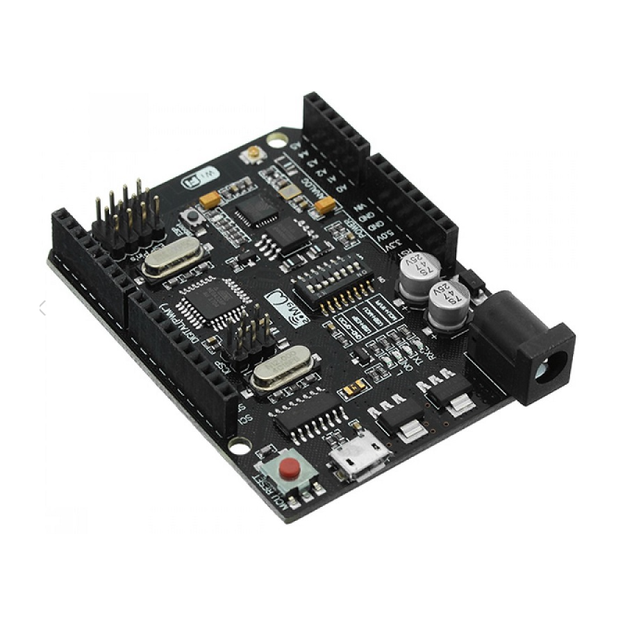

## Servidor IoT - Portal Cautivo & Token

### 📌 Índice de Contenidos

#### I. Especificaciones de Hardware (HW)

* <a href="#Hardware">Especificaciones de Hardware</a>

#### II. Arquitectura de Software (SW)

* <a href="#Arquitectura">Arquitectura General</a>
* <a href="#Dependencias">A. Dependencias y Librerías</a>
* <a href="#Mecanismos">B. Mecanismos de Persistencia (`EEPROM`)</a>
* <a href="#Diagrama">C. Diagrama de Flujo del Arranque (`setup()`)</a>

#### III. Modos de Operación del Servidor

* <a href="#Modos">Modos del Servidor</a>
* <a href="#ModoAp">A. Modo AP (Portal Cautivo)</a>
* <a href="#ModoSta">B. Modo STA (Servidor de Trabajo)</a>

#### IV. Mecanismos de Mantenimiento y Seguridad

* <a href="#Mecanismos">Mantenimiento y Seguridad</a>
* <a href="#Generacion">A. Generación y Renovación de Token</a>
* <a href="#Restablecimiento">B. Función de Restablecimiento de Fábrica</a>

### I. Especificaciones de Hardware (HW)  

| Componente | Modelo | Función Principal | Configuración Clave |
| :--- | :--- | :--- | :--- |
| **Placa Base** | Arduino Uno + WiFi R3 (Híbrido) | Plataforma de desarrollo principal. | Utiliza **DIP Switches** para alternar modos (Flasheo/Comunicación). |
| **Microcontrolador Principal** | **ESP8266EX** (Módulo ESP-12E) | Maneja toda la lógica de Wi-Fi, servidor web y EEPROM. | Frecuencia de reloj de 80 MHz o 160 MHz. |
| **Memoria Persistente** | **Flash/EEPROM** | Almacena el código del *sketch* y las credenciales de red. | Espacio dedicado de **96 bytes** para SSID y Contraseña. |
| **Interfaz Serial** | CH340G | Convierte la señal USB para la comunicación con los microcontroladores. | Velocidad de comunicación de **115200 baudios**. |

### II. Arquitectura de Software (SW)  

El *software* opera en un bucle (`loop()`) que alterna entre dos modos principales y maneja una función de reinicio de mantenimiento.

#### A. Dependencias y Librerías  

El *sketch* utiliza las siguientes librerías estándar del ecosistema ESP8266:

| Librería | Propósito Técnico |
| :--- | :--- |
| **`ESP8266WiFi`** | Gestión de los modos de red (AP y STA). |
| **`DNSServer`** | Habilita la redirección de solicitudes DNS al servidor web (Portal Cautivo). |
| **`ESP8266WebServer`** | Implementación del protocolo HTTP/1.1 para servir páginas y manejar *requests*. |
| **`EEPROM`** | Permite la lectura y escritura persistente de datos de configuración. |

#### B. Mecanismos de Persistencia (`EEPROM`)  

| Función | Propósito | Rango de Bytes |
| :--- | :--- | :--- |
| `saveCredentials()` | Escribe SSID y Password en la memoria Flash. | Bytes 0 a 95. |
| `loadCredentials()` | Lee los datos al inicio. Se usa `0xFF` o `\0` como indicador de "memoria vacía". | Bytes 0 a 95. |

#### C. Diagrama de Flujo del Arranque (`setup()`)  

El *sketch* opera bajo una lógica condicional estricta al iniciar:

1.  **Carga Credenciales:** Ejecuta `loadCredentials()`.
2.  **Verificación:** Si `wifi_ssid[0]` es `0xFF` o `\0` (Memoria Vacía / Borrada):
    * **$\rightarrow$ Ejecuta `startConfigPortal()` (Modo AP)**.
3.  **Conexión:** Si se encuentran credenciales válidas:
    * Intenta la conexión Wi-Fi (`WiFi.begin()`).
    * **Si Falla:** $\rightarrow$ Ejecuta `startConfigPortal()` (Modo AP).
    * **Si Éxito:** $\rightarrow$ Ejecuta **Servidor de Trabajo** (Modo STA).

### III. Modos de Operación del Servidor  

#### A. Modo AP (Portal Cautivo)

| Característica | Detalle Técnico |
| :--- | :--- |
| **Propósito** | Capturar credenciales de red cuando el dispositivo no puede conectarse. |
| **Red** | **`Configurar_ESP`** (SSID) / `password_config` (Key). |
| **IP del Servidor** | **`192.168.4.1`** (IP estática configurada por `WiFi.softAPConfig()`). |
| **Manejo Web** | El *handler* `handleRoot()` sirve el formulario HTML. `handleSave()` escribe en la EEPROM y llama a `ESP.restart()`. |

#### B. Modo STA (Servidor de Trabajo)  

| Característica | Detalle Técnico |
| :--- | :--- |
| **Propósito** | Proporcionar el servicio de seguridad y la IP de acceso. |
| **Red** | Se conecta a la red configurada por el usuario (ej., "ECOBULL"). |
| **IP del Servidor** | **IP dinámica** asignada por el router del usuario (ej., `192.168.101.22`). |
| **Manejo Web** | El *handler* `/` (raíz) muestra la **IP de Trabajo** (`localIP.toString()`) y el **Token Temporal**. |

### IV. Mecanismos de Mantenimiento y Seguridad  

#### A. Generación y Renovación de Token  

| Parámetro | Valor | Detalle |
| :--- | :--- | :--- |
| **Intervalo** | $300,000$ ms | 5 minutos. |
| **Función** | `generateToken()` | Combina `millis()` con un número pseudo-aleatorio (`random()`) para garantizar unicidad en cada ciclo. |
| **Lógica** | Verificación en el `loop()`: `if (currentTime - lastTokenTime >= tokenInterval)`. |

#### B. Función de Restablecimiento de Fábrica  

| Comando Serial | `RESET_WIFI` |
| :--- | :--- |
| **Mecanismo** | La función `handleSerialInput()` monitorea el puerto Serial. |
| **Acción** | Si se recibe el comando, sobrescribe la EEPROM con **`0xFF`** en todos los 96 bytes de credenciales, seguido de `ESP.restart()`. |
| **Resultado** | El dispositivo entra en el ciclo de **Modo AP** en el siguiente arranque, simulando un dispositivo de fábrica. |

### 🔗 Recursos Adicionales

* <a href="./docs/manual_usuario.md">Manual de Usuario</a>
* <a href="./docs/evaluacion_ia.md">Evaluación Actual</a>
* <a href="./docs/developer.md">Soporte</a>
