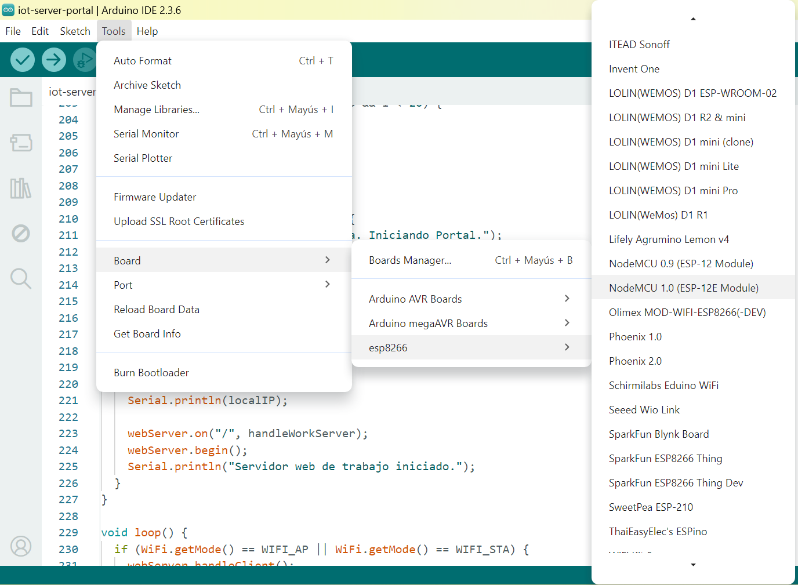
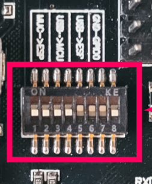
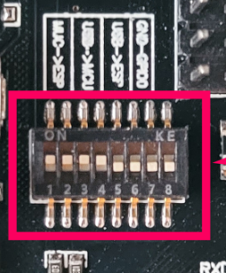
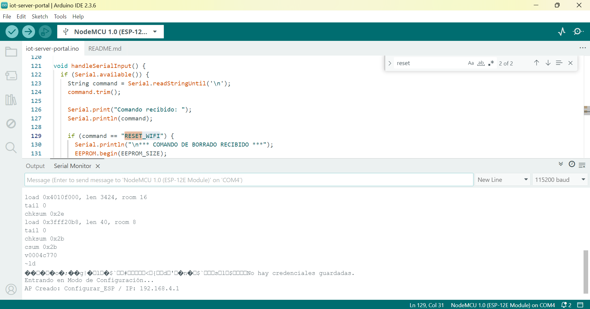

## Documentación para soporte - <a href="../README.md">volver</a>  

Este proyecto implementa un Servidor IoT con Portal Cautivo y Token Temporal en una placa híbrida **Arduino Uno + WiFi R3 (ESP8266)**.

### I. Hardware Básico y Configuración de DIP Switches

El chip ESP8266 (el microcontrolador Wi-Fi) se comunica con el USB de la PC a través de un chip intermediario. La operación requiere manipular los **Interruptores DIP** para dirigir la señal serial (TX/RX) al chip correcto.

| Modo de Operación | Propósito | Configuración de DIP Switches (1-7) |
| :--- | :--- | :--- |
| **1. Flasheo/Carga de Código** | Subir el *firmware* (`.ino`) al ESP8266. | `OFF-OFF-OFF-OFF-ON-ON-ON` |
| **2. Comunicación/Debugging** | Ejecutar el *firmware* y ver los mensajes en el Monitor Serial. | `OFF-OFF-OFF-OFF-ON-ON-OFF` |
| **3. Operación Autónoma** | Desconectar del PC y usar fuente externa. | **Misma que Comunicación** |

| Flasheo/Carga de Código | Comunicación/Debugging |
| :--- | :--- |
|  |   |

> **Regla de Oro:** Siempre debes cambiar los DIP Switches al **Modo de Comunicación** (2) después de subir el código para que el programa se ejecute correctamente.

---

### II. Flujo de Trabajo del Desarrollador (Debugging)

Para trabajar con este proyecto, sigue este ciclo:

#### 1. Carga Inicial del Código

* Ajusta los DIP Switches al **Modo 1 (Flasheo)**.
* En el IDE de Arduino, selecciona **`NodeMCU 1.0 (ESP-12E Module)`** y sube el código unificado.

#### 2. Ejecución y Debugging

* Ajusta los DIP Switches al **Modo 2 (Comunicación)**.
* Abre el **Monitor Serial** (a **115200 baudios**).
* Presiona el botón de **Reset (RST/EN)** en la placa.
* El Monitor Serial te informará el modo actual de la placa:
    * **Modo Configuración (AP):** `No hay credenciales guardadas. Entrando en Modo de Configuración...`
    * **Modo de Trabajo (STA):** `Conexión OK. IP de trabajo: 192.168.X.X`

#### 3. Herramienta de Mantenimiento (`RESET_WIFI`)

Para probar el ciclo de configuración sin recargar el código:

* **Comando:** Escribe **`RESET_WIFI`** en la barra de entrada del Monitor Serial y presiona Enter.
* **Resultado:** El dispositivo borra las credenciales de la EEPROM y se reinicia automáticamente en el **Modo de Configuración (AP)**.

---

### III. 💾 Arquitectura de *Software*: Modos y Funciones Clave

El *firmware* está diseñado para ser reactivo y autónomo. El código se divide en dos modos que nunca se ejecutan al mismo tiempo.

| Modo/Función | Función Técnica | Qué Hace |
| :--- | :--- | :--- |
| **`setup()`** | **Manejador de Conexión** | Lógica principal: decide si entrar en Modo AP (si falla la conexión) o en Modo STA (si hay éxito). |
| **`startConfigPortal()`** | **Modo AP** (Punto de Acceso) | Crea la red **`Configurar_ESP`** y sirve el formulario HTML (`handleRoot()`) en **`192.168.4.1`**. |
| **`handleWorkServer()`** | **Modo STA** (Cliente) | Sirve la página principal con la **IP dinámica** y el **Token Temporal**. Esta es la funcionalidad de producción. |
| **`saveCredentials()`** | **Persistencia** | Escribe las credenciales de red en la **EEPROM** para que se recuerden al apagar y encender. |
| **`loop()`** | **Mantenimiento** | Llama a `webServer.handleClient()` y `handleSerialInput()` para que el servidor y el reset serial se ejecuten continuamente. |

---

### IV. 🔒 Seguridad y Token Temporal

El servidor está configurado para un Token de Acceso que tiene una vida útil limitada.

* **Intervalo:** La constante `tokenInterval` está fijada en **300000 ms (5 minutos)**.
* **Renovación:** La función `handleWorkServer()` verifica si han pasado 5 minutos desde `lastTokenTime`. Si es así, llama a `generateToken()` para crear una nueva clave.
* **Token:** La clave es una combinación de `millis()` y un número aleatorio, visible en la página web.

> **Advertencia de Nivel 0:** Si necesitas cambiar el tiempo de vida del Token, solo tienes que modificar la línea:
> `const long tokenInterval = 300000;`
